# UNIVESP-PI_DRP04-S_005-G_006

Projeto Integrador - UNIVESP: Desenvolvimento de um software com framework web que utilize noções de banco de dados, praticando controle de versão.

Integrantes do Grupo:

- Bernardo Lima dos Santos, RA 1811895
- Bruna de Oliveira, RA 2211351
- Paulo Sergio da Silva Machado, RA 2213937
- Roddy E. Ramos Gonzáles, RA 2211457

__________________________________________________________________________
## Demo
Apresentação dos insights da aplicação:

- Framework hospedado na url: https://my-app-univesp-control-estoque-748b428833d1.herokuapp.com/auth/login/
 <br>
 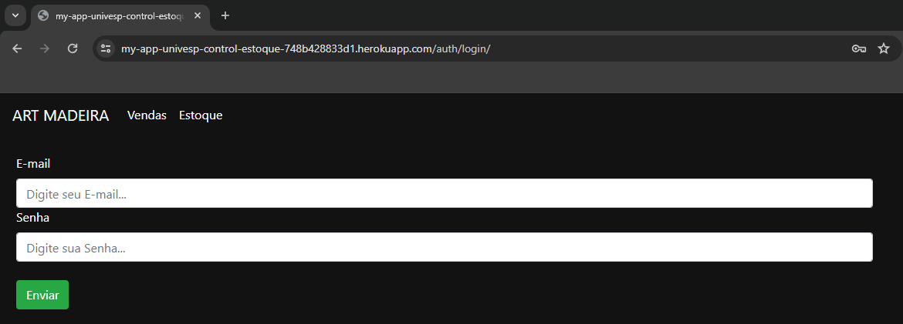
 <i>OBS: Necessário possuir login para acessar</i>
<br>
<br>
- Slide da realização de venda dos produtos: https://my-app-univesp-control-estoque-748b428833d1.herokuapp.com/vendas/vendas_produto/
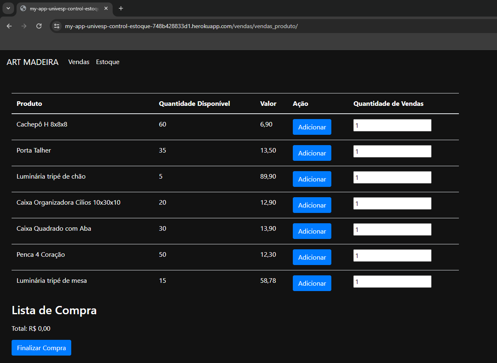
<br>
<br>
- Slide do estoque: https://my-app-univesp-control-estoque-748b428833d1.herokuapp.com/estoque/estoque_home
<br>
<br>
Produto:
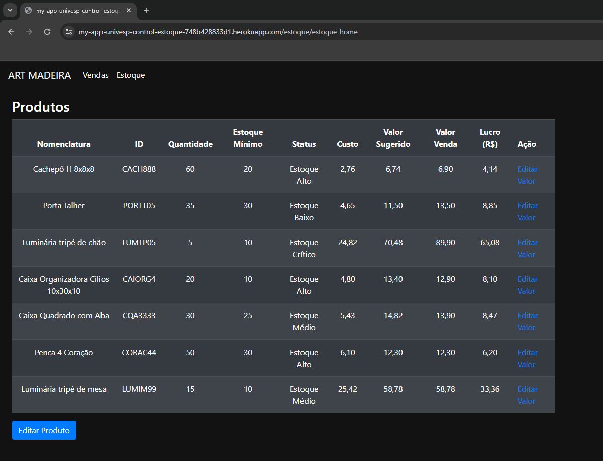
<br>
Editor de Valor:

<br>
Materia Prima:
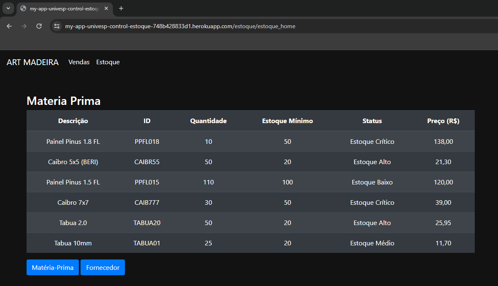
<br>
<br>
- Slide Produto: https://my-app-univesp-control-estoque-748b428833d1.herokuapp.com/estoque/add_produto/
 <br>
 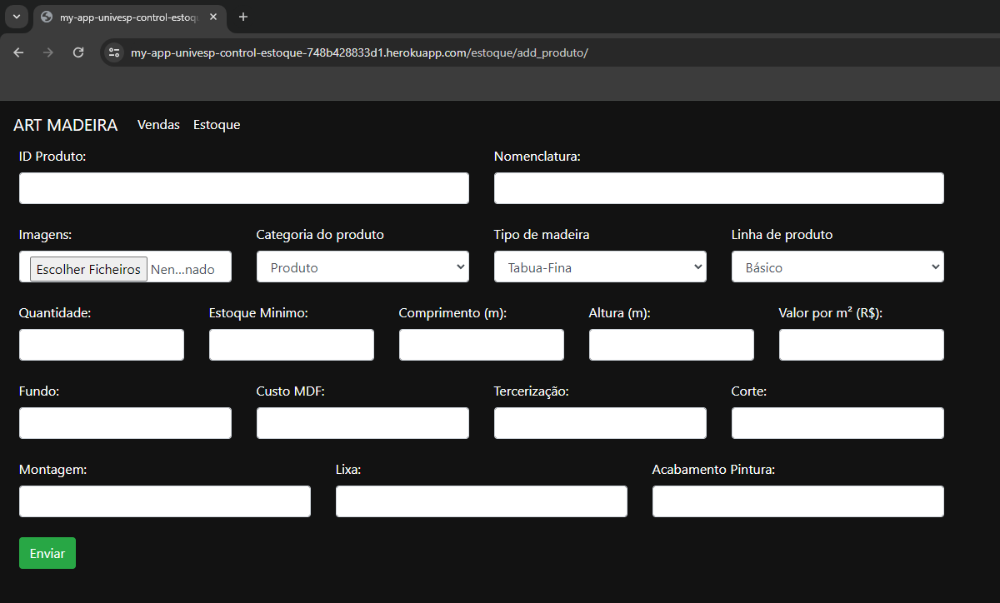
 <br>
 Filtro:
 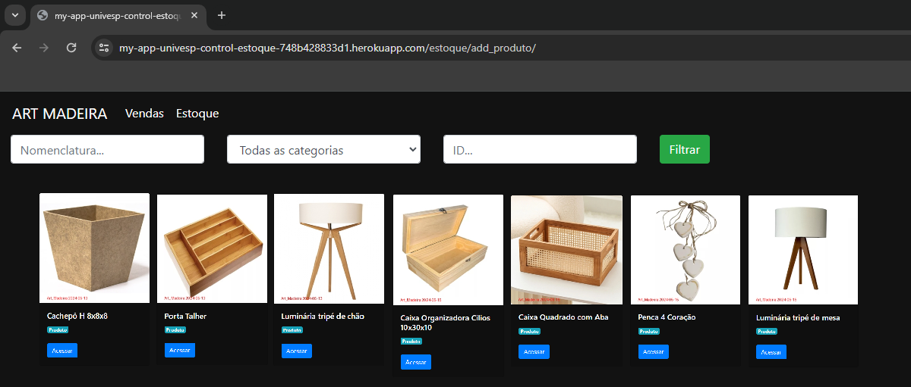
 <br>
 Editor:
 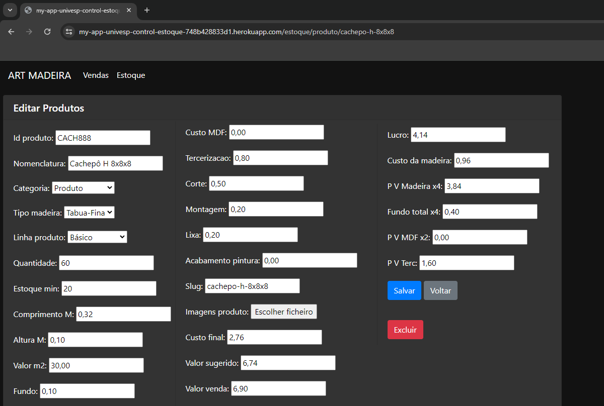
 <br>
 <br>
- Slide Materia Prima: https://my-app-univesp-control-estoque-748b428833d1.herokuapp.com/estoque/add_materiaprima/
<br>
<br>
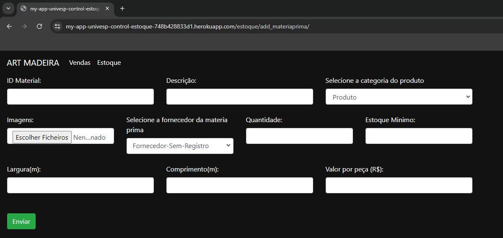
<br>
Filtro:
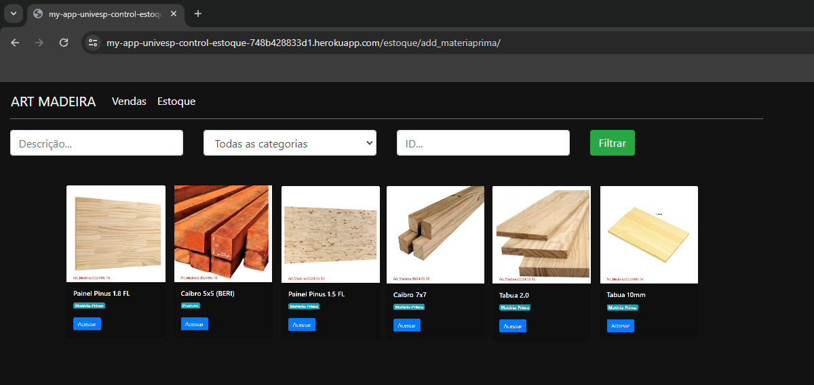
<br>
Editor:
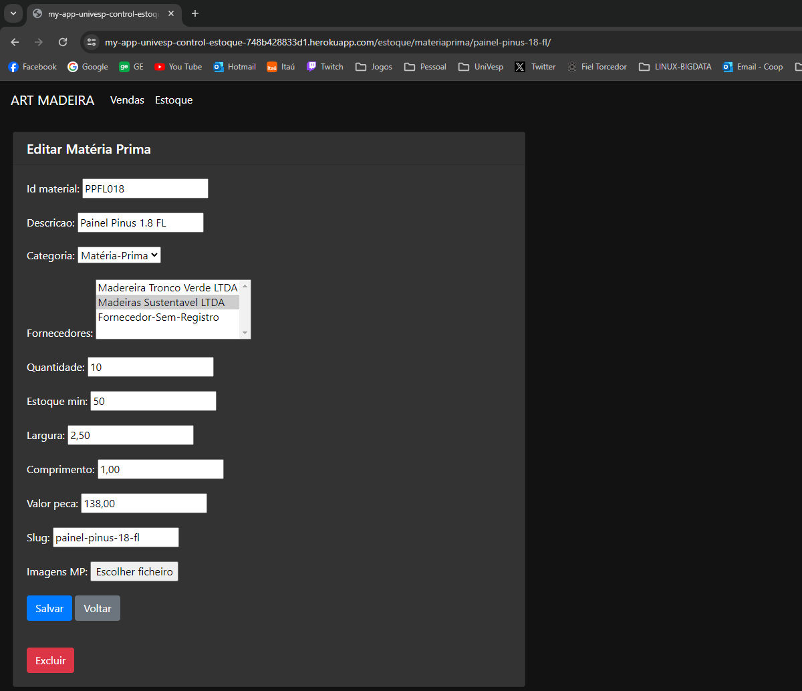
<br>
<br>
- Slide Fornecedor: https://my-app-univesp-control-estoque-748b428833d1.herokuapp.com/estoque/add_fornecedor/
<br>
<br>
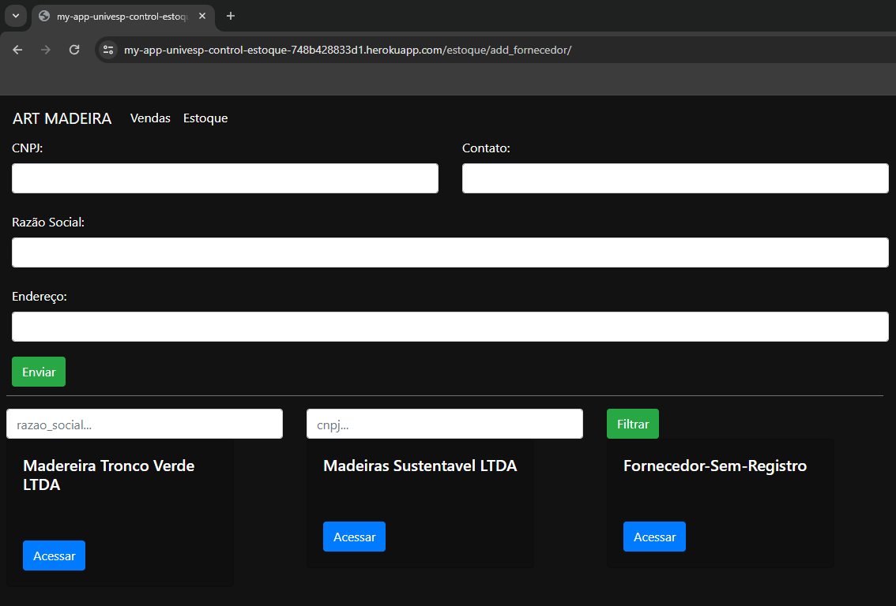
<br>
Editor:
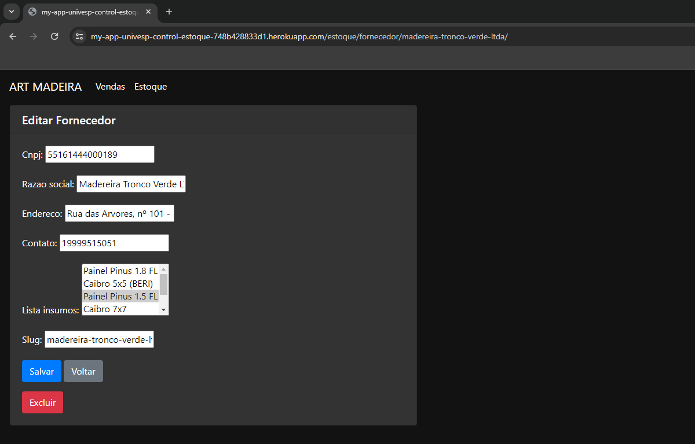
<br>
<br>
- Slide Cadastrar Vendedor: https://my-app-univesp-control-estoque-748b428833d1.herokuapp.com/auth/cadastrar_vendedor/
<br>
<br>
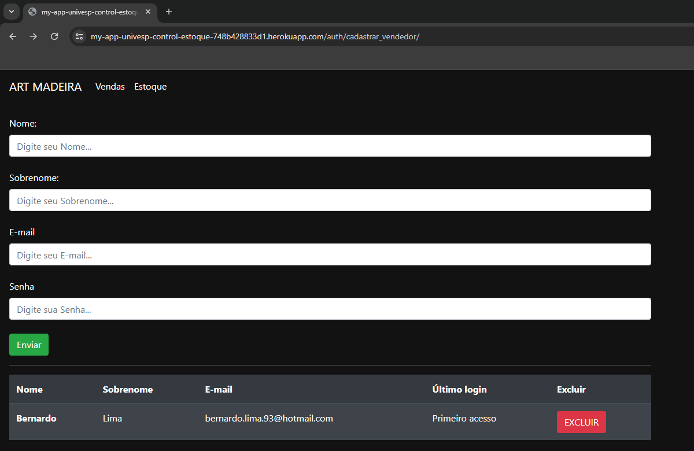
<br>
<br>

__________________________________________________________________________
## Pré Requisitos
Para replicação deste projeto, certifique-se de ter instalado e/ou configurado os seguintes recursos:

- [ ] Realize download e instalação do Python https://www.python.org/downloads/
- [ ] Realize download e instalação do VSCODE https://code.visualstudio.com/download ou outra IDE de sua preferência.
- [ ] Realize download e instalação do Heroku https://devcenter.heroku.com/articles/heroku-cli#install-the-heroku-cli
- [ ] Realize download e instalação do GIT  https://git-scm.com/book/en/v2/Getting-Started-Installing-Git


### 1 - Criação do Ambiente Python:

Ao abrir sua IDE, acesse o Terminal e execute o comando abaixo para criação do ambiente virtual:
```sh
python -m venv venv
```

Ativação do Ambiente Virtual (Windows):
```sh
.\venv\Scripts\Activate.ps1
```

Instalação das bibliotecas necessárias utilizadas na ambiente virtual:
```sh
pip install -r requirements.txt
```
Criar arquivos de migração para qualquer mudança feita nos modelos (models) da sua aplicação:
```sh
py manage.py makemigrations
py manage.py migrate
```
Criar usuario admin:
```sh
py manage.py createsuperuser
```
Inicia um servidor web local:
```sh
py manage.py runserver
```

### 2 - Criação do Deploy:

Realizando o login e deploy no Heroku:
```sh
heroku login
git init
heroku git:remote -a your_app
git add .
git commit -am ":rocket: feat: Deploy Inicial"
git push heroku master
```
Caso sua aplicação esteja configurada corretamente. Terá exato no deploy, e Heroku irá devolver a url pertecente a sua aplicação:

